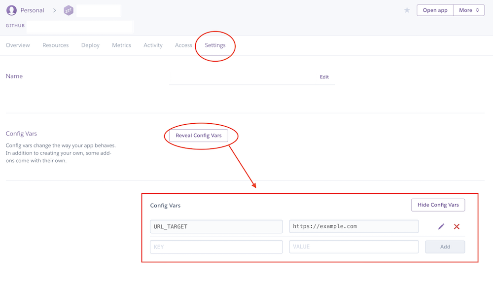

# CORS proxy
During surfing through internet you will find open APIs which are open ... yeah, but don't support CORS.

Here you have ready to use small node.js server which adds CORS headers.

## How to use it?

### On CI/heroku/whatever

* Set environment variable: `URL_TARGET` to your proxy target url. f.e.: `https://example.com`
* `npm ci` (which is `npm install` but from `package-lock.json`)
* `npm start`

### Test it locally

Run it with parameter: `npm start https://example.com`

OR

Run it with environment variable `URL_TARGET=https://example.com node server.js`

### Bonus: How to set env variable on Heroku
